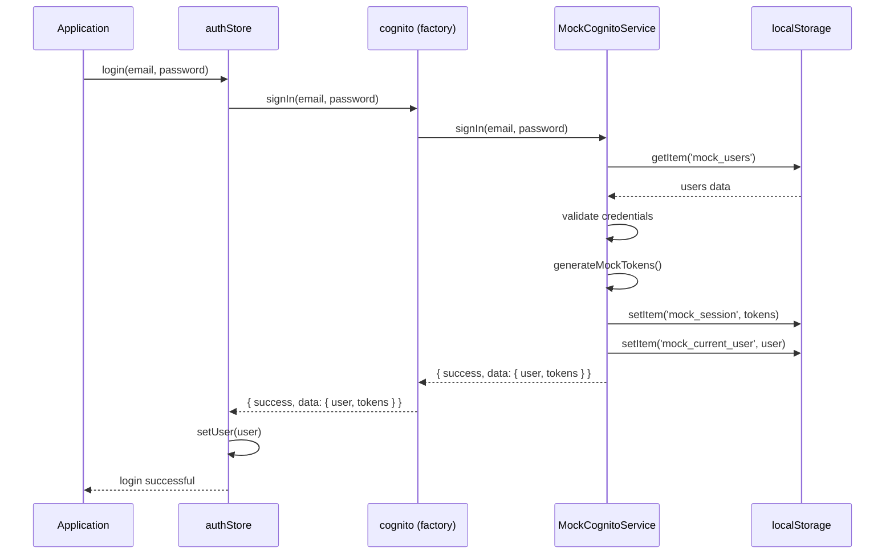

# Design Document: Mock Cognito Development Mode

## Overview

This design implements a mock authentication service that mimics AWS Cognito's behavior for local development. The solution uses a factory pattern to switch between real and mock implementations based on environment configuration, ensuring zero code changes in consuming components. Mock data is persisted in localStorage to simulate session management, and realistic JWT tokens are generated to maintain compatibility with the existing API client.

## Architecture

### High-Level Architecture

```
┌─────────────────────────────────────────────────────────┐
│                   Application Layer                      │
│  (authStore, Components, API Client)                    │
└────────────────────┬────────────────────────────────────┘
                     │
                     │ Uses CognitoService interface
                     │
┌────────────────────▼────────────────────────────────────┐
│              Cognito Service Factory                     │
│  (lib/cognito.ts - exports appropriate implementation)  │
└────────┬───────────────────────────────┬────────────────┘
         │                               │
         │ Mock Mode                     │ Production Mode
         │                               │
┌────────▼──────────────┐    ┌──────────▼─────────────────┐
│  MockCognitoService   │    │  RealCognitoService        │
│  (lib/mockCognito.ts) │    │  (lib/realCognito.ts)      │
└───────┬───────────────┘    └────────────────────────────┘
        │
        │ Stores data in
        │
┌───────▼────────────────────────────────────────────────┐
│              LocalStorage                               │
│  - mock_users: User registration data                  │
│  - mock_session: Current session tokens                │
│  - mock_current_user: Active user data                 │
└─────────────────────────────────────────────────────────┘
```

### Component Interaction Flow



## Components and Interfaces

### 1. Environment Configuration

**File:** `.env.local` (developer's local environment)

```env
# Set to "true" to enable mock authentication
NEXT_PUBLIC_USE_MOCK_AUTH=true

# Real Cognito config (ignored when mock mode is active)
NEXT_PUBLIC_COGNITO_USER_POOL_ID=your-pool-id
NEXT_PUBLIC_COGNITO_CLIENT_ID=your-client-id
```

### 2. Cognito Service Interface

All implementations must conform to this interface:

```typescript
interface ICognitoService {
  signUp(email: string, password: string, userData: UserData): Promise<SignUpResult>;
  confirmSignUp(email: string, code: string): Promise<ConfirmResult>;
  signIn(email: string, password: string): Promise<SignInResult>;
  signOut(): Promise<SignOutResult>;
  getCurrentUser(): Promise<User | null>;
  getCurrentSession(): Promise<SessionTokens | null>;
  getAccessToken(): Promise<string | null>;
  forgotPassword(email: string): Promise<ForgotPasswordResult>;
  forgotPasswordSubmit(email: string, code: string, newPassword: string): Promise<ResetPasswordResult>;
}

interface UserData {
  firstName: string;
  lastName: string;
  phoneNumber?: string;
  role: UserRole;
}

interface SignUpResult {
  success: boolean;
  data?: {
    userSub: string;
    user: UserData;
    isSignUpComplete: boolean;
    nextStep: any;
  };
  error?: string;
}

interface SignInResult {
  success: boolean;
  data?: {
    user: User;
    tokens: SessionTokens;
  };
  error?: string;
  nextStep?: any;
}

interface SessionTokens {
  accessToken: string;
  idToken: string;
  refreshToken: string;
}
```

### 3. Mock Cognito Service Implementation

**File:** `lib/mockCognito.ts`

**Key Methods:**

#### signUp
- Validates email format and password strength
- Checks for duplicate emails in localStorage
- Hashes password using base64 encoding (simple for dev purposes)
- Stores user in `mock_users` array in localStorage
- Returns mock user ID (UUID v4)

#### confirmSignUp
- Accepts any 6-digit code except "000000" (for error testing)
- Marks user as confirmed in localStorage
- Returns success response

#### signIn
- Retrieves users from localStorage
- Validates email and password
- Generates mock JWT tokens
- Stores session in localStorage
- Returns user data and tokens

#### generateMockTokens
- Creates realistic JWT structure: `header.payload.signature`
- Includes user claims in payload (id, email, role, custom attributes)
- Uses base64 encoding for header and payload
- Generates random signature for realism
- Sets expiration times (1 hour for access, 24 hours for refresh)

#### getCurrentUser / getCurrentSession
- Retrieves data from localStorage
- Validates token expiration
- Returns null if session expired

#### signOut
- Clears `mock_session` and `mock_current_user` from localStorage
- Returns success response

#### forgotPassword
- Validates user exists
- Generates random 6-digit code
- Logs code to console (simulates email)
- Stores code temporarily in localStorage with 10-minute expiration

#### forgotPasswordSubmit
- Validates code matches stored code
- Updates password in `mock_users`
- Clears reset code from localStorage

### 4. Real Cognito Service Implementation

**File:** `lib/realCognito.ts`

This file contains the current production implementation (extracted from existing `lib/cognito.ts`). It uses AWS Amplify Auth v6 for real Cognito integration.

### 5. Cognito Service Factory

**File:** `lib/cognito.ts` (refactored)

```typescript
import { MockCognitoService } from './mockCognito';
import { RealCognitoService } from './realCognito';

const USE_MOCK_AUTH = process.env.NEXT_PUBLIC_USE_MOCK_AUTH === 'true';

// Log warning if mock mode is active
if (USE_MOCK_AUTH && typeof window !== 'undefined') {
  console.warn(
    '%c[MOCK AUTH] Mock authentication is ACTIVE. This should only be used in development!',
    'background: #ff9800; color: white; font-size: 14px; padding: 4px 8px; border-radius: 4px;'
  );
}

// Export the appropriate implementation
export const cognito = USE_MOCK_AUTH ? MockCognitoService : RealCognitoService;

// For backwards compatibility
export const CognitoService = cognito;
```

## Data Models

### LocalStorage Schema

#### mock_users
```typescript
interface MockUser {
  id: string; // UUID
  email: string;
  password: string; // Base64 encoded
  firstName: string;
  lastName: string;
  phoneNumber?: string;
  role: UserRole;
  profileImageUrl?: string;
  confirmed: boolean;
  createdAt: string;
  updatedAt: string;
}

// Stored as: localStorage.setItem('mock_users', JSON.stringify(MockUser[]))
```

#### mock_session
```typescript
interface MockSession {
  accessToken: string;
  idToken: string;
  refreshToken: string;
  expiresAt: number; // Unix timestamp
  user: User;
}

// Stored as: localStorage.setItem('mock_session', JSON.stringify(MockSession))
```

#### mock_current_user
```typescript
// Stored as: localStorage.setItem('mock_current_user', JSON.stringify(User))
```

#### mock_reset_codes
```typescript
interface MockResetCode {
  email: string;
  code: string;
  expiresAt: number; // Unix timestamp
}

// Stored as: localStorage.setItem('mock_reset_codes', JSON.stringify(MockResetCode[]))
```

### Mock JWT Token Structure

```
Header (Base64):
{
  "alg": "HS256",
  "typ": "JWT"
}

Payload (Base64):
{
  "sub": "user-uuid",
  "email": "user@example.com",
  "given_name": "John",
  "family_name": "Doe",
  "phone_number": "+1234567890",
  "custom:role": "CLIENT_USER",
  "iat": 1234567890,
  "exp": 1234571490,
  "iss": "mock-cognito"
}

Signature:
Random base64 string (for realism, not validated)
```

### Pre-seeded Default Users

```typescript
const DEFAULT_MOCK_USERS: MockUser[] = [
  {
    id: 'mock-user-client',
    email: 'client@test.com',
    password: btoa('password123'), // Base64 encoded
    firstName: 'Test',
    lastName: 'Client',
    phoneNumber: '+1234567890',
    role: 'CLIENT_USER',
    confirmed: true,
    createdAt: new Date().toISOString(),
    updatedAt: new Date().toISOString(),
  },
  {
    id: 'mock-user-gym',
    email: 'gym@test.com',
    password: btoa('password123'),
    firstName: 'Test',
    lastName: 'Gym',
    phoneNumber: '+1234567891',
    role: 'GYM_STAFF',
    confirmed: true,
    createdAt: new Date().toISOString(),
    updatedAt: new Date().toISOString(),
  },
  {
    id: 'mock-user-pt',
    email: 'trainer@test.com',
    password: btoa('password123'),
    firstName: 'Test',
    lastName: 'Trainer',
    phoneNumber: '+1234567892',
    role: 'PT_USER',
    confirmed: true,
    createdAt: new Date().toISOString(),
    updatedAt: new Date().toISOString(),
  },
  {
    id: 'mock-user-admin',
    email: 'admin@test.com',
    password: btoa('password123'),
    firstName: 'Test',
    lastName: 'Admin',
    phoneNumber: '+1234567893',
    role: 'ADMIN',
    confirmed: true,
    createdAt: new Date().toISOString(),
    updatedAt: new Date().toISOString(),
  },
];
```

## Error Handling

### Mock Service Error Scenarios

1. **Duplicate Email Registration**
   - Error: "User already exists"
   - HTTP equivalent: 409 Conflict

2. **Invalid Login Credentials**
   - Error: "Invalid email or password"
   - HTTP equivalent: 401 Unauthorized

3. **User Not Found**
   - Error: "User not found"
   - HTTP equivalent: 404 Not Found

4. **Invalid Verification Code**
   - Error: "Invalid verification code"
   - HTTP equivalent: 400 Bad Request

5. **Expired Session**
   - Error: "Session expired"
   - HTTP equivalent: 401 Unauthorized

6. **Invalid Password Format**
   - Error: "Password must be at least 8 characters"
   - HTTP equivalent: 400 Bad Request

### Error Response Format

All errors follow the same format as real Cognito:

```typescript
{
  success: false,
  error: "Error message here"
}
```

## Testing Strategy

### Unit Testing

**Test File:** `lib/__tests__/mockCognito.test.ts`

**Test Cases:**

1. **Sign Up Tests**
   - Should successfully register a new user
   - Should reject duplicate email registration
   - Should validate password requirements
   - Should store user in localStorage
   - Should return mock user ID

2. **Confirm Sign Up Tests**
   - Should accept valid 6-digit codes
   - Should reject code "000000" for error testing
   - Should mark user as confirmed
   - Should return error for non-existent user

3. **Sign In Tests**
   - Should successfully sign in with valid credentials
   - Should reject invalid password
   - Should reject non-existent user
   - Should generate valid JWT tokens
   - Should store session in localStorage

4. **Token Generation Tests**
   - Should generate tokens with correct structure
   - Should include all user claims in payload
   - Should set appropriate expiration times
   - Should be decodable as base64

5. **Session Management Tests**
   - Should retrieve current user from localStorage
   - Should return null for expired sessions
   - Should persist across page refreshes
   - Should clear on sign out

6. **Password Reset Tests**
   - Should generate reset code for valid email
   - Should log code to console
   - Should accept valid reset code
   - Should update password in localStorage
   - Should reject expired codes

### Integration Testing

**Test File:** `store/__tests__/authStore.mock.test.ts`

**Test Cases:**

1. Should integrate with authStore for login flow
2. Should integrate with authStore for registration flow
3. Should maintain session across store rehydration
4. Should clear session on logout

### Manual Testing Checklist

- [ ] Enable mock mode via environment variable
- [ ] Verify console warning appears on app load
- [ ] Sign up with new user credentials
- [ ] Confirm sign up with any 6-digit code
- [ ] Sign in with registered credentials
- [ ] Verify session persists after page refresh
- [ ] Sign in with pre-seeded test users
- [ ] Test forgot password flow
- [ ] Verify tokens are included in API requests
- [ ] Sign out and verify session is cleared
- [ ] Switch to real Cognito mode and verify it works
- [ ] Verify no mock indicators appear in production mode

## Development Mode Indicators

### Console Warning

On application initialization in mock mode:

```javascript
console.warn(
  '%c[MOCK AUTH] Mock authentication is ACTIVE',
  'background: #ff9800; color: white; font-size: 14px; padding: 4px 8px;'
);

console.log('%c[MOCK AUTH] Available test users:', 'color: #2196f3; font-weight: bold;');
console.table([
  { Email: 'client@test.com', Password: 'password123', Role: 'CLIENT_USER' },
  { Email: 'gym@test.com', Password: 'password123', Role: 'GYM_STAFF' },
  { Email: 'trainer@test.com', Password: 'password123', Role: 'PT_USER' },
  { Email: 'admin@test.com', Password: 'password123', Role: 'ADMIN' },
]);
```

### UI Banner Component

**File:** `components/dev/MockAuthBanner.tsx`

```typescript
export function MockAuthBanner() {
  const isMockMode = process.env.NEXT_PUBLIC_USE_MOCK_AUTH === 'true';
  
  if (!isMockMode) return null;
  
  return (
    <div className="bg-orange-500 text-white px-4 py-2 text-center text-sm font-medium">
      ⚠️ DEVELOPMENT MODE: Mock Authentication Active
    </div>
  );
}
```

Add to root layout:

```typescript
// app/layout.tsx
import { MockAuthBanner } from '@/components/dev/MockAuthBanner';

export default function RootLayout({ children }) {
  return (
    <html>
      <body>
        <MockAuthBanner />
        {children}
      </body>
    </html>
  );
}
```

### Prefixed Console Logs

All mock service logs are prefixed:

```typescript
console.log('[MOCK AUTH] User signed in:', user.email);
console.log('[MOCK AUTH] Generated tokens:', tokens);
console.log('[MOCK AUTH] Reset code for', email, ':', code);
```

## Security Considerations

### Development Only

1. Mock mode should NEVER be enabled in production
2. Environment variable check ensures this
3. Build process should exclude mock files from production bundle

### Password Storage

1. Passwords are base64 encoded (not secure, but acceptable for dev)
2. Real production uses AWS Cognito's secure password handling
3. Mock passwords are only stored in browser localStorage

### Token Validation

1. Mock tokens are NOT cryptographically signed
2. Backend should validate tokens properly in production
3. Mock tokens are for frontend development only

### Data Persistence

1. All mock data is stored in localStorage (client-side only)
2. Clearing browser data removes all mock users
3. No server-side persistence for mock data

## Performance Considerations

1. **localStorage Access**: All operations are synchronous and fast
2. **Token Generation**: Simple base64 encoding, no crypto overhead
3. **Memory Usage**: Minimal, only stores active session and user list
4. **No Network Calls**: All operations are local, instant response

## Migration Path

### Switching from Real to Mock

1. Set `NEXT_PUBLIC_USE_MOCK_AUTH=true` in `.env.local`
2. Restart development server
3. Clear browser localStorage (optional, for clean state)
4. Use pre-seeded test credentials or register new users

### Switching from Mock to Real

1. Set `NEXT_PUBLIC_USE_MOCK_AUTH=false` or remove variable
2. Ensure real Cognito credentials are configured
3. Restart development server
4. Register real users through Cognito

### No Code Changes Required

The factory pattern ensures that switching between modes requires zero code changes in:
- authStore
- Components
- API client
- Any code using the cognito service

## Future Enhancements

1. **Mock User Profiles**: Add ability to customize mock user data
2. **Token Expiration Simulation**: Add UI to manually expire tokens for testing
3. **Network Delay Simulation**: Add configurable delays to simulate API latency
4. **Multi-Factor Auth Mock**: Simulate MFA flows
5. **Session Refresh Mock**: Implement token refresh simulation
6. **Export/Import Mock Data**: Allow saving and loading mock user sets
