# EasyBody Database ERD

> **Full Entity Relationship Diagram** - Generated from Flyway migrations (V0__create_core_tables.sql)
> 
> **Tech Stack:** PostgreSQL 15 + PostGIS 3.4 | Spring Boot 3 + Hibernate Spatial

---

## 📊 Complete ERD Diagram

```mermaid
erDiagram
    %% ============================================
    %% CORE AUTHENTICATION & USER MANAGEMENT
    %% ============================================
    
    users {
        BIGSERIAL id PK "Primary Key"
        VARCHAR_100 cognito_sub UK "AWS Cognito Subject (Unique)"
        VARCHAR_255 email UK "Email (Unique)"
        VARCHAR_100 first_name "First Name"
        VARCHAR_100 last_name "Last Name"
        VARCHAR_30 phone_number "Phone Number (Optional)"
        VARCHAR_32 role "🔐 Role: ADMIN | GYM_STAFF | PT_USER | CLIENT_USER"
        BOOLEAN active "Active Status (Default: TRUE)"
        TEXT profile_image_url "Profile Image URL"
        TIMESTAMPTZ created_at "Created Timestamp"
        TIMESTAMPTZ updated_at "Updated Timestamp"
    }
    
    %% Note: ADMIN users don't have separate table
    %% They are identified by role='ADMIN' in users table
    %% ADMIN can moderate offers, review reports, manage system

    %% ============================================
    %% LOCATION & SPATIAL DATA (PostGIS)
    %% ============================================
    
    locations {
        BIGSERIAL id PK "Primary Key"
        DOUBLE_PRECISION latitude "Latitude Coordinate"
        DOUBLE_PRECISION longitude "Longitude Coordinate"
        GEOMETRY_POINT coordinates "PostGIS Point (SRID 4326) - GIST Indexed"
        TEXT formatted_address "Formatted Address (Optional)"
        TIMESTAMPTZ created_at "Created Timestamp"
        TIMESTAMPTZ updated_at "Updated Timestamp"
    }

    %% ============================================
    %% GYM ENTITIES
    %% ============================================
    
    gyms {
        BIGSERIAL id PK "Primary Key"
        VARCHAR_255 name "Gym Name"
        VARCHAR_2000 description "Gym Description"
        TEXT logo_url "Logo URL"
        VARCHAR_1000 address "Street Address"
        VARCHAR_255 city "City"
        VARCHAR_255 state "State/Province"
        VARCHAR_255 country "Country"
        VARCHAR_50 postal_code "Postal Code"
        VARCHAR_50 phone_number "Contact Phone"
        VARCHAR_255 email "Contact Email"
        VARCHAR_255 website "Website URL"
        BIGINT location_id FK "→ locations(id) ON DELETE SET NULL"
        BOOLEAN active "Active Status (Default: TRUE)"
        BOOLEAN verified "Verified Status (Default: FALSE)"
        TIMESTAMPTZ created_at "Created Timestamp"
        TIMESTAMPTZ updated_at "Updated Timestamp"
    }

    gym_staff {
        BIGSERIAL id PK "Primary Key"
        BIGINT user_id FK "→ users(id) ON DELETE CASCADE"
        BIGINT gym_id FK "→ gyms(id) ON DELETE CASCADE"
        VARCHAR_255 position "Job Position/Title"
        BOOLEAN can_manage_offers "Permission: Manage Offers"
        BOOLEAN can_manage_pts "Permission: Manage PT Associations"
        BOOLEAN active "Active Status (Default: TRUE)"
        TIMESTAMPTZ created_at "Created Timestamp"
        TIMESTAMPTZ updated_at "Updated Timestamp"
    }

    %% ============================================
    %% PERSONAL TRAINER ENTITIES
    %% ============================================
    
    pt_users {
        BIGSERIAL id PK "Primary Key"
        BIGINT user_id FK "→ users(id) ON DELETE CASCADE (Unique)"
        VARCHAR_2000 bio "PT Biography"
        VARCHAR_1000 specializations "Specializations (comma-separated)"
        VARCHAR_1000 certifications "Certifications (comma-separated)"
        INTEGER years_of_experience "Years of Experience"
        TEXT profile_image_url "Profile Image URL"
        BIGINT location_id FK "→ locations(id) ON DELETE SET NULL"
        BOOLEAN active "Active Status (Default: TRUE)"
        BOOLEAN verified "Verified Status (Default: FALSE)"
        TIMESTAMPTZ created_at "Created Timestamp"
        TIMESTAMPTZ updated_at "Updated Timestamp"
    }

    gym_pt_associations {
        BIGSERIAL id PK "Primary Key"
        BIGINT gym_id FK "→ gyms(id) ON DELETE CASCADE"
        BIGINT pt_user_id FK "→ pt_users(id) ON DELETE CASCADE"
        VARCHAR_32 approval_status "Status: PENDING, APPROVED, REJECTED"
        VARCHAR_1000 rejection_reason "Rejection Reason (if rejected)"
        BIGINT approved_by_user_id FK "→ users(id) ON DELETE SET NULL"
        TIMESTAMPTZ approved_at "Approval Timestamp"
        TIMESTAMPTZ created_at "Created Timestamp"
        TIMESTAMPTZ updated_at "Updated Timestamp"
    }

    %% ============================================
    %% CLIENT ENTITIES
    %% ============================================
    
    client_users {
        BIGSERIAL id PK "Primary Key"
        BIGINT user_id FK "→ users(id) ON DELETE CASCADE (Unique)"
        BIGINT location_id FK "→ locations(id) ON DELETE SET NULL"
        VARCHAR_1000 fitness_goals "Fitness Goals"
        VARCHAR_1000 preferred_activities "Preferred Activities"
        TIMESTAMPTZ created_at "Created Timestamp"
        TIMESTAMPTZ updated_at "Updated Timestamp"
    }

    %% ============================================
    %% OFFERS & MARKETPLACE
    %% ============================================
    
    offers {
        BIGSERIAL id PK "Primary Key"
        VARCHAR_255 title "Offer Title"
        VARCHAR_3000 description "Offer Description"
        VARCHAR_32 offer_type "Type: GYM_OFFER, PT_OFFER"
        BIGINT gym_id FK "→ gyms(id) ON DELETE CASCADE (for GYM_OFFER)"
        BIGINT pt_user_id FK "→ pt_users(id) ON DELETE CASCADE (for PT_OFFER)"
        NUMERIC_10_2 price "Price (CHECK: price > 0)"
        VARCHAR_10 currency "Currency Code (Default: USD)"
        VARCHAR_255 duration_description "Duration Description"
        VARCHAR_1000 image_urls "Image URLs (comma-separated)"
        VARCHAR_32 status "Status: PENDING, APPROVED, REJECTED (Indexed)"
        NUMERIC_5_2 risk_score "AI Moderation Risk Score (0-1)"
        VARCHAR_1000 rejection_reason "Rejection Reason (if rejected)"
        BIGINT moderated_by_user_id FK "🔐 ADMIN who moderated → users(id)"
        TIMESTAMPTZ moderated_at "⏱️ When ADMIN moderated"
        NUMERIC_3_2 average_rating "Average Rating (0-5, auto-calculated)"
        INTEGER rating_count "Total Rating Count (auto-calculated)"
        BOOLEAN active "Active Status (Default: TRUE)"
        TIMESTAMPTZ created_at "Created Timestamp"
        TIMESTAMPTZ updated_at "Updated Timestamp"
    }

    %% ============================================
    %% RATINGS & REVIEWS
    %% ============================================
    
    ratings {
        BIGSERIAL id PK "Primary Key"
        BIGINT offer_id FK "→ offers(id) ON DELETE CASCADE"
        BIGINT client_user_id FK "→ users(id) ON DELETE CASCADE"
        INTEGER rating "Rating Value (CHECK: 1-5)"
        VARCHAR_2000 comment "Review Comment"
        TIMESTAMPTZ created_at "Created Timestamp"
        TIMESTAMPTZ updated_at "Updated Timestamp"
    }

    %% ============================================
    %% REPORTS & MODERATION
    %% ============================================
    
    reports {
        BIGSERIAL id PK "Primary Key"
        BIGINT reported_by_user_id FK "→ users(id) ON DELETE CASCADE"
        BIGINT offer_id FK "→ offers(id) ON DELETE SET NULL"
        BIGINT reported_user_id FK "→ users(id) ON DELETE SET NULL"
        VARCHAR_1000 reason "Report Reason"
        VARCHAR_2000 details "Report Details"
        VARCHAR_32 status "Status: PENDING, REVIEWED, DISMISSED (Indexed)"
        BIGINT reviewed_by_user_id FK "🔐 ADMIN who reviewed → users(id)"
        TIMESTAMPTZ reviewed_at "⏱️ When ADMIN reviewed"
        VARCHAR_1000 review_notes "📝 ADMIN's review notes"
        TIMESTAMPTZ created_at "Created Timestamp"
        TIMESTAMPTZ updated_at "Updated Timestamp"
    }

    %% ============================================
    %% RELATIONSHIPS
    %% ============================================
    
    %% User Profile Extensions
    users ||--o| pt_users : "has PT profile"
    users ||--o| client_users : "has client profile"
    users ||--o{ gym_staff : "works at gym(s)"
    
    %% Location Relationships
    locations ||--o{ gyms : "gym location"
    locations ||--o{ pt_users : "PT location"
    locations ||--o{ client_users : "client location"
    
    %% Gym Relationships
    gyms ||--o{ gym_staff : "employs staff"
    gyms ||--o{ gym_pt_associations : "associates with PTs"
    gyms ||--o{ offers : "publishes gym offers"
    
    %% PT Relationships
    pt_users ||--o{ gym_pt_associations : "works at gyms"
    pt_users ||--o{ offers : "publishes PT offers"
    
    %% Offer Relationships
    offers ||--o{ ratings : "receives ratings"
    offers ||--o{ reports : "can be reported"
    
    %% User Action Relationships (Role-Based)
    users ||--o{ ratings : "submits ratings (CLIENT_USER)"
    users ||--o{ reports : "submits reports (any role)"
    users ||--o{ reports : "is reported (any role)"
    users ||--o{ offers : "moderates offers (ADMIN only)"
    users ||--o{ reports : "reviews reports (ADMIN only)"
    users ||--o{ gym_pt_associations : "approves PT associations (GYM_STAFF)"
    
    %% Unique Constraints
    %% ratings: UNIQUE(offer_id, client_user_id) - one rating per user per offer
```



---

## 🔑 Key Features & Constraints

### Unique Constraints
- **users**: `cognito_sub` (AWS Cognito integration), `email`
- **pt_users**: `user_id` (one PT profile per user)
- **client_users**: `user_id` (one client profile per user)
- **ratings**: `(offer_id, client_user_id)` - prevents duplicate ratings

### Check Constraints
- **offers.price**: `price > 0` (must be positive)
- **ratings.rating**: `rating BETWEEN 1 AND 5`

### Indexes
- **locations.coordinates**: GIST spatial index for PostGIS queries
- **offers.status**: B-tree index for filtering
- **offers.offer_type**: B-tree index for filtering
- **gym_pt_associations.approval_status**: B-tree index
- **reports.status**: B-tree index

### Triggers
1. **set_updated_at()**: Auto-updates `updated_at` on all tables
2. **sync_location_geometry()**: Auto-syncs `coordinates` from `latitude`/`longitude`
3. **refresh_offer_rating()**: Auto-calculates `average_rating` and `rating_count` when ratings change

---

## 🎭 Role-Based Access Control

> **Note**: Roles are stored in `users.role` column (VARCHAR(32))  
> **No separate admin table** - ADMIN is a role value, not a separate entity

### 🔐 ADMIN (role='ADMIN')
- **Moderation Powers**:
  - Approve/reject offers (`offers.moderated_by_user_id` → `users.id`)
  - Review and manage reports (`reports.reviewed_by_user_id` → `users.id`)
  - View all pending content
- **System Access**: Full access to all endpoints
- **Database Relations**:
  - `offers.moderated_by_user_id` FK → `users.id` (where role='ADMIN')
  - `reports.reviewed_by_user_id` FK → `users.id` (where role='ADMIN')

### 🏋️ GYM_STAFF (role='GYM_STAFF')
- **Gym Management**:
  - Create and update gym information
  - Manage gym staff assignments
  - Create gym offers (`offers.gym_id` → `gyms.id`)
- **PT Management**:
  - Approve/reject PT associations (if `gym_staff.can_manage_pts = true`)
  - `gym_pt_associations.approved_by_user_id` → `users.id`
- **Database Relations**:
  - `gym_staff.user_id` FK → `users.id` (where role='GYM_STAFF')
  - `gym_staff.gym_id` FK → `gyms.id`

### 💪 PT_USER (role='PT_USER')
- **Profile Management**:
  - Create and manage PT profile (`pt_users.user_id` → `users.id`)
  - Set specializations, certifications, bio
- **Gym Associations**:
  - Request gym associations (`gym_pt_associations`)
  - Work at multiple gyms (many-to-many)
- **Offer Management**:
  - Create PT offers (`offers.pt_user_id` → `pt_users.id`)
  - View ratings and reports on own offers
- **Database Relations**:
  - `pt_users.user_id` FK → `users.id` (where role='PT_USER', UNIQUE)

### 👤 CLIENT_USER (role='CLIENT_USER')
- **Discovery**:
  - Browse gyms and offers (public endpoints)
  - Search by location (PostGIS spatial queries)
- **Engagement**:
  - Submit ratings (`ratings.client_user_id` → `users.id`)
  - Write reviews and comments
  - Report inappropriate content (`reports.reported_by_user_id` → `users.id`)
- **Profile**:
  - Manage personal profile (`client_users.user_id` → `users.id`)
  - Set fitness goals and preferences
- **Database Relations**:
  - `client_users.user_id` FK → `users.id` (where role='CLIENT_USER', UNIQUE)
  - `ratings.client_user_id` FK → `users.id`

---

## 📍 PostGIS Spatial Queries

### Nearby Gym Search
```sql
SELECT g.* 
FROM gyms g
JOIN locations l ON g.location_id = l.id
WHERE g.active = true 
  AND ST_DWithin(
    l.coordinates::geography,
    ST_SetSRID(ST_MakePoint(:longitude, :latitude), 4326)::geography,
    :radiusMeters
  )
ORDER BY ST_Distance(
  l.coordinates::geography,
  ST_SetSRID(ST_MakePoint(:longitude, :latitude), 4326)::geography
);
```

### Distance Calculation
```sql
SELECT 
  ST_Distance(
    l.coordinates::geography,
    ST_SetSRID(ST_MakePoint(:lon, :lat), 4326)::geography
  ) / 1000 AS distance_km
FROM locations l;
```

---

## 🔄 Data Flow Examples

### Offer Creation & Moderation Flow
```
1. GYM_STAFF/PT_USER creates offer → status: PENDING
2. (Optional) SQS moderation queue → AI risk scoring → updates risk_score
3. ADMIN reviews offer:
   - Approve: status = APPROVED
   - Reject: status = REJECTED + rejection_reason
   - Logs: moderated_by_user_id (ADMIN's user.id) + moderated_at (timestamp)
4. Approved offers appear in search results
```

**Database Audit Trail:**
- `offers.moderated_by_user_id` → tracks which ADMIN approved/rejected
- `offers.moderated_at` → tracks when the moderation happened
- `offers.rejection_reason` → stores why it was rejected (if applicable)

### Rating Aggregation Flow
```
1. CLIENT_USER submits rating (1-5 stars + comment)
2. Trigger: refresh_offer_rating() fires
3. Auto-calculates: average_rating, rating_count
4. Updates offers table immediately
```

### Report Review Flow
```
1. Any user submits report → status: PENDING
   - Can report offers (offer_id) or users (reported_user_id)
   - Logs: reported_by_user_id + reason + details
2. ADMIN reviews report:
   - Mark as REVIEWED (action taken)
   - Mark as DISMISSED (no action needed)
   - Logs: reviewed_by_user_id (ADMIN's user.id) + reviewed_at + review_notes
3. System tracks full audit trail of who reported and who reviewed
```

**Database Audit Trail:**
- `reports.reported_by_user_id` → who submitted the report
- `reports.reviewed_by_user_id` → which ADMIN reviewed it
- `reports.reviewed_at` → when the review happened
- `reports.review_notes` → ADMIN's notes/decision reasoning

### PT-Gym Association Flow
```
1. PT_USER requests association with gym
2. gym_pt_associations created → approval_status: PENDING
3. GYM_STAFF (with can_manage_pts) approves/rejects
4. If approved: PT can create offers linked to that gym
```

---

## 📚 Related Documentation

- **Schema Migrations**: `src/main/resources/db/migration/V0__create_core_tables.sql`
- **Local Setup**: `docs/backend/DATABASE_LOCAL_SETUP.md`
- **API Documentation**: `docs/api/API_DOCUMENTATION.md`
- **Nearby Search**: `docs/api/API_NEARBY_SEARCH.md`

---

**Last Updated**: January 2025  
**Database Version**: PostgreSQL 15 + PostGIS 3.4  
**Migration Version**: V0 (Core Tables) + V1 (Extensions) + V2 (Triggers) + V3 (Seed Data)
