# Archived – không còn dùng cho Spring Boot/Postgres
# Base Idea Archive (Legacy)

Curated from original planning documents (Idea.docx, Layout.docx, Cấu trúc.docx) and early markdown drafts. Use this as a historical reference; current implementation details live in `docs/PROJECT_OVERVIEW.md`.

## Cấu trúc

Các loại tài nguyên: mạng, lưu trữ, tính toán,

IAM -> VPC -> EC2 -> S3 -> s

Frontend → S3/Amplify/CloudFront  (hosting web)
Backend  → EC2 Instance           (FastAPI, Node.js, Flask, etc.)
Database → RDS / SQLite / MySQL   (tuỳ chọn)

/home/ec2-user/
└── backend/
├── main.py             # file khởi chạy FastAPI
├── requirements.txt
├── app/
│   ├── routes/
│   ├── models/
│   └── ...
├── .env
└── start.sh            # script start server

S3: Khi build xong frontend upload file index.html, bundle.js… lên S3 bucket (Website tĩnh)
Amplify

The backend folder is deployed on an EC2 instance, running a FastAPI service exposed via port 8000.
The frontend hosted on S3/CloudFront communicates with this backend through API Gateway or direct HTTP calls.

Frontend (S3/CloudFront/Amplify)
↓
Backend (EC2 / Lambda)
↓
RDS PostgreSQL (Private subnet)

The backend API, hosted on EC2, connects to an Amazon RDS PostgreSQL instance for persistent storage.
This architecture separates compute and data layers, improving scalability and reliability.

Cognito Identity Pool is integrated with IAM roles to dynamically grant temporary credentials for authorized S3 actions.

## 💡 6. Tích hợp thêm cho đẹp sơ đồ
Anh có thể thêm node mới vào VPC diagram:
Private Subnet
├── EC2 Backend (no public IP)
├── RDS Database
└── EC2 Instance Connect Endpoint (EICE)

→ Rồi kẻ mũi tên:
Laptop → AWS Console → EICE → EC2 Backend

Sơ đồ này mà anh chèn vào proposal thì có điểm “security enhancement” cực cao, đúng kiểu reviewer AWS thích luôn 😏

CLoudformation:
AWSTemplateFormatVersion: "2010-09-09"
Description: Simple FCJ Demo Stack - EC2 + Security Group + S3 Bucket

Parameters:
KeyPairName:
Type: AWS::EC2::KeyPair::KeyName
Description: Name of an existing EC2 KeyPair to enable SSH access
InstanceType:
Type: String
Default: t3.micro
Description: EC2 instance type

Resources:
# --- Security Group ---
AppSecurityGroup:
Type: AWS::EC2::SecurityGroup
Properties:
GroupDescription: Allow SSH (22) and API (8000)
VpcId: !Ref DefaultVPC
SecurityGroupIngress:
- IpProtocol: tcp
FromPort: 22
ToPort: 22
CidrIp: 0.0.0.0/0
- IpProtocol: tcp
FromPort: 8000
ToPort: 8000
CidrIp: 0.0.0.0/0

# --- EC2 Instance ---
BackendInstance:
Type: AWS::EC2::Instance
Properties:
InstanceType: !Ref InstanceType
KeyName: !Ref KeyPairName
ImageId: ami-0c02fb55956c7d316  # Amazon Linux 2 (ap-southeast-1)
SecurityGroupIds:
- !Ref AppSecurityGroup
Tags:
- Key: Name
Value: FCJ-Backend

# --- S3 Bucket ---
DemoBucket:
Type: AWS::S3::Bucket
Properties:
BucketName: !Sub "fcj-demo-bucket-${AWS::AccountId}"
AccessControl: Private
VersioningConfiguration:
Status: Enabled
Tags:
- Key: Purpose
Value: FCJ-Demo-Storage

Outputs:
EC2PublicIP:
Description: Public IP of EC2 instance
Value: !GetAtt BackendInstance.PublicIp

S3BucketName:
Description: S3 bucket for storage
Value: !Ref DemoBucket

DEPLOY:
aws cloudformation create-stack \
--stack-name fcj-demo-stack \
--template-body file://infra.yaml \
--parameters ParameterKey=KeyPairName,ParameterValue=<your-keypair-name> \
--capabilities CAPABILITY_IAM

Anh chỉ cần 2 cách là quá đủ:
SSH trực tiếp (22) — cho EC2 public.
EC2 Instance Connect / SSM Session Manager — cho EC2 private.
Còn các kiểu như RDP Gateway, VPN, Bastion… là production-level, để khi anh scale lớn lên thì vẫn nối được mà không mở port lung tung.
✅ Một setup gợi ý cho FCJ:
1 VPC (CIDR: 10.0.0.0/16)
Public Subnet: EC2 backend + NAT gateway (nếu cần ra Internet)
Private Subnet (optional): RDS hoặc InfluxDB
S3 để chứa frontend
IAM role để cấp quyền truy cập (SSM, S3, v.v.)
Route Table + Security Group cấu hình tối giản.
Anh chỉ cần vẽ được sơ đồ: User → CloudFront/S3 → API Gateway → EC2 (FastAPI backend) → RDS/S3,
deploy một con EC2 chạy File Gateway và link nó với S3 bucket

Cần login, dashboard động, ISR/SSR → Amplify Hosting (Next.js) là đường ngắn nhất.
Muốn “thực chiến AWS thuần” → CloudFront + S3 + Lambda (OpenNext).

Rồi, nhìn bộ code anh dán là em đọc ra profile kỹ thuật rõ luôn 😎
 Đây là Next.js 14 (App Router) chạy frontend thuần, không có SSR hay API Routes nội bộ, mà gọi backend riêng (FastAPI / API Gateway).
 Phân tích chi tiết cho anh nha 👇

## 🧩 1. Về cấu hình Next.js
experimental: {
appDir: true,
},

→ nghĩa là dùng App Router, tức Next.js 13+ (ở đây là 14).
 App Router cho phép dùng Server Component hoặc Client Component, nhưng không bắt buộc SSR.
 Không có getServerSideProps, revalidate, hay generateStaticParams → => app này đang là CSR (Client Side Rendering), chỉ fetch API khi render bên browser.

## ⚙️ 2. Dấu hiệu không có SSR/ISR
Trong component HomePage, anh render toàn component UI (Hero, SearchFilters, FeaturedGyms...)
 và không thấy hàm:
export async function getServerSideProps() {}
export const revalidate = ...

→ nên chắc chắn là không có SSR hay ISR.
Toàn bộ dữ liệu (nếu có) sẽ được fetch trong client component (ví dụ dùng useEffect + axios gọi API backend).

## 💬 3. Không có API routes nội bộ
Repo anh không có app/api/.../route.ts hoặc pages/api/...
 → nghĩa là Next.js chỉ là frontend (không phải fullstack Next app).
API của anh được config qua env:
NEXT_PUBLIC_API_BASE_URL

→ nên tất cả request sẽ gọi về backend riêng (FastAPI, API Gateway, v.v.)

## 🌐 4. Cấu hình môi trường AWS
Các biến env cho thấy app này kết nối:
NEXT_PUBLIC_S3_BUCKET: nơi chứa hình ảnh gym/trainer/offer.
NEXT_PUBLIC_COGNITO_USER_POOL_ID + CLIENT_ID: xác thực người dùng qua AWS Cognito.
NEXT_PUBLIC_AWS_REGION: vùng chạy (ví dụ ap-southeast-1).
→ App gọi trực tiếp AWS Cognito + backend API (FastAPI), và hiển thị hình ảnh từ S3.

## 🧱 5. Cách deploy phù hợp
Vì app này là CSR tĩnh nên build ra file HTML/JS/CSS tĩnh:
npm run build
npx next export

→ tạo folder /out chứa static site.
Sau đó anh có thể:
Upload lên S3 → chọn “Static Website Hosting”.
Dùng CloudFront làm CDN.
Không cần EC2 hay Lambda, vì app không render server.

## 🔧 6. Nếu muốn SSR / ISR sau này
Anh có thể:
Dùng export const revalidate = 60 trong từng page → có ISR.
Dùng getServerSideProps hoặc Server Components để query API tại server → có SSR.
Dùng app/api để tạo route → có API routes.
Hiện tại repo của anh chưa có các phần đó.

## ✅ 7. Tóm lại cho dễ nhớ

💬 Tóm vui cho dễ hiểu:
“App của anh là React mặt tiền — Next.js chỉ cầm cọ.
 Backend mới là người nấu ăn (FastAPI).
 S3 chỉ là cái khung treo tranh, không có bếp SSR/ISR trong đó 😄.”

Anh muốn em viết cho anh cấu trúc deploy S3 + CloudFront chuẩn cho app này (Next.js static + FastAPI backend EC2) luôn không?
 Em gói ra sơ đồ + config bucket/public path cho anh chạy là được 🥀

Tổng kết ngày:

Chuẩn bị ngồi vững nha 😎 — dưới đây là toàn bộ cấu trúc từ A → Z cho demo EasyBody (Next.js + Spring Boot + AWS), đúng format mà giảng viên FCJ, mentor AWS, hay thậm chí tech lead ngoài thực tế đọc vô là hiểu ngay.

```mermaid
%% AWS Architecture Diagram (Full) – EasyBody Project

flowchart TB

%% User Layer
subgraph User[User Layer]
U[User Browser\n(Next.js Frontend)]
end

%% CDN and Hosting
subgraph CDN[Content Delivery]
CF[CloudFront CDN\n(Global Edge Network)]
S3FE[S3 Static Hosting\n(Next.js CSR Build)]
end

%% Backend Compute
subgraph Compute[Backend Layer]
APIGW[API Gateway\n(Optional)]
EC2[EC2 Instance\n(Spring Boot 3 / Java 21)]
end

%% Data Layer
subgraph Data[Data & Storage]
RDS[(RDS PostgreSQL 15)]
S3DATA[S3 Bucket\n(Uploads & Media)]
end

%% Authentication & Security
subgraph Auth[Authentication]
COG[AWS Cognito\nUser Pool / JWT Auth]
end

%% Networking
subgraph Network[VPC Network]
VPC[VPC 10.0.0.0/16]
PUB[Public Subnet\n(EC2 + IGW)]
PRI[Private Subnet\n(RDS + NAT GW)]
IGW[Internet Gateway]
NAT[NAT Gateway]
end

%% Monitoring & DNS
subgraph Monitor[Ops & DNS]
CW[CloudWatch\nLogs & Metrics]
XR[AWS X-Ray\nTracing]
BKP[AWS Backup\nRDS Snapshots]
R53[Route 53\nDNS / Custom Domain]
end

%% User Flow
U --> CF --> S3FE
U -->|Axios / API Calls| APIGW
APIGW --> EC2

%% Backend Connections
EC2 --> RDS
EC2 --> S3DATA
EC2 --> COG
EC2 --> CW
EC2 --> XR

%% Networking Links
VPC --> PUB
VPC --> PRI
PUB --> IGW
PRI --> NAT

%% Route 53 Links
R53 --> CF
R53 --> APIGW

%% Backup Link
BKP --> RDS

```
BE (IAM role) signs with:

 s3Client.generatePresignedUrl(bucket, key, expiration)

Client PUT file to URL
File accessible via https://easybody-assets.s3.amazonaws.com/...

## 🧰 8. Networking (VPC + Subnet + Gateway)
Structure:
VPC (10.0.0.0/16)
├── Public Subnet (10.0.1.0/24)
│   ├── IGW (Internet Gateway)
│   ├── EC2 (Spring Boot)
│   └── NAT Gateway → Private subnet
└── Private Subnet (10.0.2.0/24)
├── RDS PostgreSQL
└── Lambda / other private services

## 🌍 9. DNS (Route 53)

## 🧩 10. Optional: CI/CD
GitHub Actions:
on:
push:
branches: [main]

jobs:
build-and-deploy:
runs-on: ubuntu-latest
steps:
- uses: actions/checkout@v3
- name: Build frontend
run: |
npm install
npm run build
npx next export
- name: Sync to S3
run: aws s3 sync ./out s3://easybody-frontend-bucket --delete

## 📊 11. Monitoring (CloudWatch + X-Ray)
EC2 metrics: CPU, RAM, disk
Log group: /aws/ec2/easybody
Spring Boot logs → CloudWatch agent
AWS X-Ray: trace API latency + S3 calls

## 🔒 12. Security Checklist

## ✅ 13. Final Outcome

## 🧭 TL;DR – Developer Flow
1️⃣ Code Next.js → npm run build && npx next export → aws s3 sync ./out s3://frontend
 2️⃣ Deploy Spring Boot .jar lên EC2 → connect RDS + S3
 3️⃣ Frontend gọi API EC2 qua API Gateway hoặc domain Route53
 4️⃣ Cognito quản lý user; RDS giữ data; S3 lưu hình ảnh
 5️⃣ CloudWatch giám sát; Backup snapshot mỗi ngày

Muốn em vẽ sơ đồ bằng AWS icon (EC2, RDS, CloudFront, S3, Cognito, API Gateway) luôn cho phần architecture diagram của proposal không?
 Nó nhìn kiểu tài liệu chính thức AWS Architect luôn á 🥀

---

## Idea

# Easy Body

(Next.js + Spring Boot + AWS + GPT vibe)

## Ý tưởng chính
Nhiều Gym và PT cùng dùng chung web để quảng bá.
Client tìm Gym/PT theo địa điểm chi, chi phí, giờ rảnh, rating.
Tạo Offer (dạng bài việt không phải post mục đích để quảng bá nội dung ưu đãi và các chính sách hỗ trợ của Gym/PT, tách đôi offer của Gym và PT):
Gym Offer: Gym_Staff tạo offer cho phòng gym của mình
PT Offer: PT tạo -> Gym_Staff duyệt trước
Cả 2 offer đều phải qua bộ lọc SageMaker Moderation: lọc spam/NSFW/lừa đảo → gán risk_score → auto-approve/pending/reject.

## Role:
Admin
Quản trị hệ thống
Duyệt nội dung (Listing/Offer/Review bị report).
Gỡ bỏ sai phạm khi report
Quản lý gói/Subscription và ưu tiên hiển thị (homepage, top search)

Gym_Staff
Đăng ký & quản lý Gym (giờ hoạt động, địa chỉ, tiện ích, min–max subscription).
Quản lý PT đang hoạt động trong Gym.
Tạo Gym Offer; duyệt PT Offer trước khi lên public.

PT_User
Tạo profile (bio, ảnh, chứng chỉ, kinh nghiệm, khung giờ rảnh).
Gắn vào 1 hoặc nhiều gym
Xác nhận chi phí subscription min-max.

Client_User
Người dùng cuối, không cần tài khoản đăng nhập trừ khi muốn lưu theo kiểu bookmark favorite gym/pt, rating, report, bình luận
Tìm kiếm gym theo địa điểm, thời gian, chi phí của gym, đánh giá.
Tìm kiếm PT theo phòng gym, giờ rảnh, giới tính, chí phí của PT, đánh giá.
Xem thông tin chi tiết và liên hệ trực tiếp với Gym/Staff/PT (qua số điện thoại, link mạng xã hội, map).

## User story:
Admin
Cấu hình subscription_tier → ảnh hưởng vị trí đề xuất/ranking của gym khi Gym_Staff đăng kí.

Gym_Staff
Tạo/chỉnh thông tin Gym; duyệt PT Offer; đăng Gym Offer.
Quản lý PT (thêm/sửa/xóa liên kết hoạt động).

PT_User
Tạo profile + set khung giờ rảnh theo Gym.
Là PT_User tôi muốn đăng kí profile của mình vào phòng gym thông qua Gym_Staff
Submit PT Offer → thấy trạng thái

Client_User
Tìm Gym/PT theo filter (địa điểm, giá, giờ rảnh, rating).
Rating/Review; bookmark; report nội dung vi phạm.

## Database:
### Core

User:
ID (PK)
Role ENUM('ADMIN','GYM_STAFF','PT','CLIENT')
Name
Birthday
Sex
Phone
Email (unique)
Created_at

Admin:
User_ID (PK, FK - User)
Note

Gym_Staff:
User_ID (PK, FK - User)
Gym_ID (FK - Gym)
Role title

PT_User:
User_ID (PK, FK - User)
Gym_ID (FK - Gym 1 - n)
Certification
Time_Available
Year_experience
Posting
Subscription_Tier (Min - Max)
Rating, Reviews, Report

Client_User:
User_ID (PK, FK - User.ID)
Location

Gym:
ID (key)
Name, URL, Email, Phone
Time_Available
location_ID (FK - Location)
Subscription_Tier (Min - Max)
Rating_and_Reviews
Gym_Staff.User_ID (FK)

Location:
ID (PK)
Location (street_number, street_name, ward, district, city, lat, lon)

PT_and_Gym
ID (PK)
PT_ID (FK - PT_user.user_id)
Gym_id (FK - Gym)

### Offers & interactions

Offer(id PK, target_type ENUM('GYM','PT'), target_id, title, description, media JSONB, valid_from, valid_to, status ENUM('PENDING','APPROVED','REJECTED','EXPIRED'), risk_score FLOAT NULL, created_by_user_id, created_at)

Review(id PK, author_user_id FK, target_type ENUM('GYM','PT'), target_id, rating INT CHECK 1–5, text, photos JSONB, visited_at DATE NULL, has_geo BOOL DEFAULT false, has_photo BOOL DEFAULT false, verified_by_staff BOOL DEFAULT false, status ENUM('PENDING','VISIBLE','HIDDEN'), created_at)

Report(id PK, reporter_user_id FK NULL, target_type ENUM('GYM','PT','REVIEW','OFFER'), target_id, reason ENUM('SPAM','FAKE','ABUSE','SCAM','OTHER'), note TEXT, status ENUM('OPEN','RESOLVED','REJECTED'), created_at, resolved_by NULL, resolved_at NULL)
### Monetization
SubscriptionPlan(id PK, name, price_month, features JSONB, rank_weight FLOAT)
GymSubscription(id PK, gym_id FK, plan_id FK, start_date, end_date, status)
### Search helpers (VIEW/materialized)
vw_search_address(doc_type 'GYM'|'PT', doc_id, display_name, normalized_text, lat, lon)
vw_filter_location(city, district, ward, count_gyms)
vw_filter_pt_time(pt_id, gym_id, weekday, start_time, end_time)

## GPT Suggestion:

### User Stories (đã khớp schema)
Admin
Cấu hình SubscriptionPlan.rank_weight → thay đổi ranking & Spotlight.
Duyệt hàng chờ ModerationQueue (xem diff, approve/reject, bulk, audit).
Gym_Staff
Quản lý Gym Listing (giờ, địa chỉ, amenities, price_band, ảnh).
Thêm/sửa/xoá liên kết PT trong PT_Gym.
Tạo Gym Offer; duyệt trước PT Offer từ PT.
PT_User
Tạo profile (bio/ảnh/chứng chỉ), set AvailabilitySlot theo Gym.
Xin liên kết vào Gym (Gym_Staff approve).
Submit PT Offer → xem trạng thái (pre-approve Gym_Staff → moderation).
Client_User
Tìm kiếm theo vị trí/giá/giờ rảnh/rating/tags;
Review/Rating, Report, Favorite;
Tạo Lead (call/zalo/map/form) — đo ROI.

### Tech-Stack:
FE Next.js: Vercel/Amplify + CloudFront (media S3).
BE Spring Boot: App Runner/ECS Fargate.
DB: RDS Postgres (＋ PostGIS cho geo).
Search: OpenSearch (hoặc Postgres GIN + trigram cho MVP).
Auth: Cognito (RBAC), IAM cho S3 presign. (Chia quyền theo Role)
Queue: SQS (moderation + image resize Lambda).
Observability: CloudWatch/X-Ray.
CI/CD: GitHub Actions (lint/test/build/deploy 2 job FE/BE).

---

## Layout

## Layout tổng
Header (top): Logo (click về Home) + Button [Đăng nhập/Đăng ký]
Bottom Nav (4 tab):
Home
Gym Offer Listing
PT Offer Listing
Profile

## Tab 1: Home → Gym Listing
Danh sách Gym (dạng card, giống Airbnb style):
Ảnh thumbnail (1 ảnh đại diện).
Tên Gym.
Khoảng cách (“Cách bạn … km”).
Rating (số sao + số review).
Subscription min – max (giá tham khảo).
OnClick Gym → trang chi tiết Gym.
### Trang chi tiết Gym
Thông tin cơ bản: tên, địa chỉ (map), số điện thoại, giờ mở cửa, tiện ích.
Review section: danh sách review (text + sao + ảnh). Client có thể đánh giá.
Button:
[Gym Offer] → list các deal của Gym.
[PT Listing] → list PT đang hoạt động ở Gym.

## Tab 2: Gym Offer Listing (Gym mua subcript của web sẽ được lên đầu)
List tất cả Offer từ các Gym (card style):
Ảnh deal + mô tả ngắn.
Gym liên quan + khoảng cách.
Hạn sử dụng (valid_to).
OnClick → xem chi tiết Offer (mô tả, hình ảnh, nút CTA liên hệ Gym).

## Tab 3: PT Offer Listing (PT mua subcript của web sẽ được lên đầu)

List Offer từ PT (giảm giá gói huấn luyện, buổi tập thử…).
Card PT Offer hiển thị:
Ảnh PT / bio ngắn.
Gym liên quan (nếu có).
Giá deal.
Hạn dùng.
OnClick → chi tiết PT Offer, có nút CTA (gọi, zalo, book).

## Tab 4: Profile
Nếu chưa login → hiển thị button [Đăng nhập/Đăng ký].
Nếu đã login → hiển thị thông tin user:
Tên, email, role (Client/PT/Gym Staff).
Bookmark (favorite Gym/PT).
Review đã viết.
Setting (đổi mật khẩu, logout).
(Nếu role là Gym_Staff/PT thì tab Profile có thêm nút: “Quản lý listing” và “Tạo Offer”).

---

## Cấu Trúc 2842dd5614df803fb608e6e679e3cbe8

# Cấu Trúc

```mermaid
%% AWS Architecture Diagram – EasyBody Project 🥀
%% Version: Icon + Color Enhanced (for Notion/Obsidian compatible)

flowchart TB

    %% User Layer
    subgraph User[🧑‍💻 User Layer]
        U[💻 User Browser — Next.js Frontend]:::frontend
    end

    %% CDN + Hosting
    subgraph CDN[🌐 Content Delivery]
        CF[☁️ CloudFront CDN — Global Edge Network]:::frontend
        S3FE[🪣 S3 Static Hosting — Next.js CSR Build]:::frontend
    end

    %% Backend Layer
    subgraph Compute[🧩 Backend Layer]
        APIGW[🚪 API Gateway — Optional Routing Layer]:::backend
        EC2[🖥️ EC2 Instance — Spring Boot 3 / Java 21]:::backend
    end

    %% Data Layer
    subgraph Data[💾 Data & Storage Layer]
        RDS[(🐘 RDS PostgreSQL 15)]:::data
        S3DATA[🪣 S3 Bucket — Uploads / Media Assets]:::data
    end

    %% Authentication
    subgraph Auth[🔐 Authentication]
        COG[🧭 AWS Cognito — JWT Auth / User Pool]:::auth
    end

    %% Network Infrastructure
    subgraph Network[🌉 VPC Network]
        VPC[🕸️ VPC — 10.0.0.0/16]:::network
        PUB[📡 Public Subnet — EC2 + IGW]:::network
        PRI[🔒 Private Subnet — RDS + NAT GW]:::network
        IGW[🌍 Internet Gateway]:::network
        NAT[🚏 NAT Gateway]:::network
    end

    %% Monitoring & DNS
    subgraph Monitor[📊 Ops & DNS]
        CW[📈 CloudWatch — Logs & Metrics]:::monitor
        XR[🧩 AWS X-Ray — Tracing & Insights]:::monitor
        BKP[💾 AWS Backup — RDS Snapshots]:::monitor
        R53[🗺️ Route 53 — DNS / Custom Domain]:::monitor
    end

    %% User Flow
    U --> CF --> S3FE
    U -->|Axios / REST Calls| APIGW
    APIGW --> EC2

    %% Backend Connections
    EC2 --> RDS
    EC2 --> S3DATA
    EC2 --> COG
    EC2 --> CW
    EC2 --> XR

    %% Networking
    VPC --> PUB
    VPC --> PRI
    PUB --> IGW
    PRI --> NAT

    %% DNS
    R53 --> CF
    R53 --> APIGW

    %% Backup
    BKP --> RDS

    %% === Style Definitions ===
    classDef frontend fill:#2196f3,stroke:#1565c0,color:white,fontWeight:bold;
    classDef backend fill:#ff9800,stroke:#e65100,color:white,fontWeight:bold;
    classDef data fill:#4caf50,stroke:#1b5e20,color:white,fontWeight:bold;
    classDef auth fill:#fdd835,stroke:#c6a700,color:black,fontWeight:bold;
    classDef network fill:#9e9e9e,stroke:#424242,color:white,fontWeight:bold;
    classDef monitor fill:#9c27b0,stroke:#6a0080,color:white,fontWeight:bold;

```



---

## Tổng quan 2842dd5614df8044b7d7d471fa0381a3

# Tổng quan

# 🧭 **Full Architecture — EasyBody Demo (Next.js + Spring Boot + AWS)**

---

## 🌐 1. Overview

**Goal:**

Xây hệ thống web quảng bá phòng gym & PT, gồm:

- Frontend (Next.js 14, CSR)
- Backend (Spring Boot 3, REST API)
- Auth (AWS Cognito)
- Storage (S3, RDS Postgres)
- Infra (VPC, CloudFront, EC2, Route 53)

---

## 🧱 2. **Logical Architecture**

```
[User Browser]
   │
   ▼
[CloudFront CDN] — HTTPS + Cache
   │
   ▼
[S3 Static Website Hosting] — Next.js build
   │
   └── Calls API → [API Gateway / EC2 Public Endpoint]
                     │
                     ▼
                [Spring Boot Backend]
                     │
      ┌──────────────┼────────────────┐
      ▼              ▼                ▼
  [RDS Postgres]   [S3 Bucket]    [Cognito Auth]
  Gym/PT Data     Uploads (images)  JWT Issuer

```

---

## 🧩 3. **Frontend (Next.js 14)**

**Tech:**

- React 18 + Next.js 14 App Router
- TailwindCSS + Zustand + React Hook Form + Axios
- Hosted on **S3 + CloudFront**

**Build & Deploy:**

```bash
npm install
npm run build
npx next export
aws s3 sync ./out s3://easybody-frontend-bucket --delete

```

**Key ENV:**

```bash
NEXT_PUBLIC_API_BASE_URL=https://api.easybody.dev
NEXT_PUBLIC_AWS_REGION=ap-southeast-1
NEXT_PUBLIC_COGNITO_USER_POOL_ID=ap-southeast-1_XXXX
NEXT_PUBLIC_COGNITO_CLIENT_ID=XXXXXXXX
NEXT_PUBLIC_S3_BUCKET=easybody-assets

```

**CloudFront Settings:**

- Origin: S3 bucket (public-read)
- Default Root Object: `index.html`
- Cache Policy: cache all, invalidate on deploy
- HTTPS: Required
- Custom Domain: via Route 53 → CloudFront alias

---

## ⚙️ 4. **Backend (Spring Boot 3 + Java 21)**

**Repo:** [`AWS_WS_BE`](https://github.com/Kenfiz123/AWS_WS_BE)

**Stack:**

- Spring Boot 3 (REST API)
- Spring Security + Cognito JWT
- JPA/Hibernate + PostgreSQL (RDS)
- AWS SDK (S3 presign, X-Ray, SQS)
- Deployed on EC2

**API Structure:**

```
/api/v1/auth
/api/v1/gym
/api/v1/trainer
/api/v1/offer
/api/v1/rating
/api/v1/report
/api/v1/admin

```

**Deployment (EC2):**

```bash
sudo yum install java-21-amazon-corretto -y
git clone https://github.com/Kenfiz123/AWS_WS_BE.git
cd AWS_WS_BE
./mvnw package -DskipTests
java -jar target/easybody.jar --server.port=8080

```

**Systemd Service (auto restart):**

```bash
sudo nano /etc/systemd/system/easybody.service

```

```
[Unit]
Description=EasyBody Spring Boot
After=network.target

[Service]
User=ec2-user
ExecStart=/usr/bin/java -jar /home/ec2-user/AWS_WS_BE/target/easybody.jar
SuccessExitStatus=143
Restart=always
RestartSec=10

[Install]
WantedBy=multi-user.target

```

**Security Group:**

| Port | Purpose | Source |
| --- | --- | --- |
| 22 | SSH | My IP |
| 8080 | API | 0.0.0.0/0 (or CloudFront) |
| 443 | HTTPS (if Nginx) | 0.0.0.0/0 |

---

## 💾 5. **Database (RDS PostgreSQL)**

**Setup:**

- Engine: PostgreSQL 15
- VPC: Private subnet
- Storage: 20GB
- Multi-AZ: optional
- SG: allow inbound from EC2 SG (port 5432)
- Parameter group: UTF-8, timezone UTC+7

**Config in app:**

```
spring.datasource.url=jdbc:postgresql://easybody-db.xxxxxx.ap-southeast-1.rds.amazonaws.com:5432/easybody
spring.datasource.username=admin
spring.datasource.password=******
spring.jpa.hibernate.ddl-auto=update

```

---

## 🧠 6. **Authentication (Cognito)**

**Components:**

- User Pool (Login/Signup)
- App Client (Frontend)
- Identity Pool (for S3 access)
- Hosted UI optional (OAuth)

**Flow:**

1. User login → Cognito returns JWT token.
2. Frontend stores token → attach in header:
    
    ```
    Authorization: Bearer eyJ...
    
    ```
    
3. Backend verifies JWT via JWKS endpoint.

---

## 🪣 7. **Storage (S3)**

**Buckets:**

- `easybody-frontend-bucket` → static website (Next.js)
- `easybody-assets` → uploaded user images

**Backend S3 presigned flow:**

1. Client requests presign URL (`/api/v1/upload/presign`)
2. BE (IAM role) signs with:
    
    ```java
    s3Client.generatePresignedUrl(bucket, key, expiration)
    
    ```
    
3. Client PUT file to URL
4. File accessible via `https://easybody-assets.s3.amazonaws.com/...`

---

## 🧰 8. **Networking (VPC + Subnet + Gateway)**

**Structure:**

```
VPC (10.0.0.0/16)
├── Public Subnet (10.0.1.0/24)
│   ├── IGW (Internet Gateway)
│   ├── EC2 (Spring Boot)
│   └── NAT Gateway → Private subnet
└── Private Subnet (10.0.2.0/24)
    ├── RDS PostgreSQL
    └── Lambda / other private services

```

---

## 🌍 9. **DNS (Route 53)**

| Record | Type | Target |
| --- | --- | --- |
| `www.easybody.dev` | A | CloudFront distro |
| `api.easybody.dev` | A | EC2 public IP or ALB |

---

## 🧩 10. **Optional: CI/CD**

**GitHub Actions:**

```yaml
on:
  push:
    branches: [main]

jobs:
  build-and-deploy:
    runs-on: ubuntu-latest
    steps:
      - uses: actions/checkout@v3
      - name: Build frontend
        run: |
          npm install
          npm run build
          npx next export
      - name: Sync to S3
        run: aws s3 sync ./out s3://easybody-frontend-bucket --delete

```

---

## 📊 11. **Monitoring (CloudWatch + X-Ray)**

- EC2 metrics: CPU, RAM, disk
- Log group: `/aws/ec2/easybody`
- Spring Boot logs → CloudWatch agent
- AWS X-Ray: trace API latency + S3 calls

---

## 🔒 12. **Security Checklist**

| Layer | Tool | Purpose |
| --- | --- | --- |
| Network | SG + NACL | hạn chế inbound/outbound |
| Data | KMS | mã hóa RDS + S3 |
| Auth | Cognito | JWT validate |
| Access | IAM Role | EC2 → S3, RDS |
| Backup | AWS Backup | snapshot RDS hằng ngày |

---

## ✅ 13. **Final Outcome**

| Module | Service | Notes |
| --- | --- | --- |
| Frontend | Next.js → S3 + CloudFront | CSR only |
| Backend | Spring Boot → EC2 | REST API |
| Database | RDS PostgreSQL | Private subnet |
| Auth | Cognito | JWT |
| Storage | S3 | presigned upload |
| DNS | Route 53 | custom domain |
| Network | VPC + NAT + IGW | isolated & secure |
| Monitor | CloudWatch + X-Ray | tracing & metrics |

---

## 🧭 TL;DR – Developer Flow

1️⃣ Code Next.js → `npm run build && npx next export` → `aws s3 sync ./out s3://frontend`

2️⃣ Deploy Spring Boot `.jar` lên EC2 → connect RDS + S3

3️⃣ Frontend gọi API EC2 qua API Gateway hoặc domain Route53

4️⃣ Cognito quản lý user; RDS giữ data; S3 lưu hình ảnh

5️⃣ CloudWatch giám sát; Backup snapshot mỗi ngày

---

---
